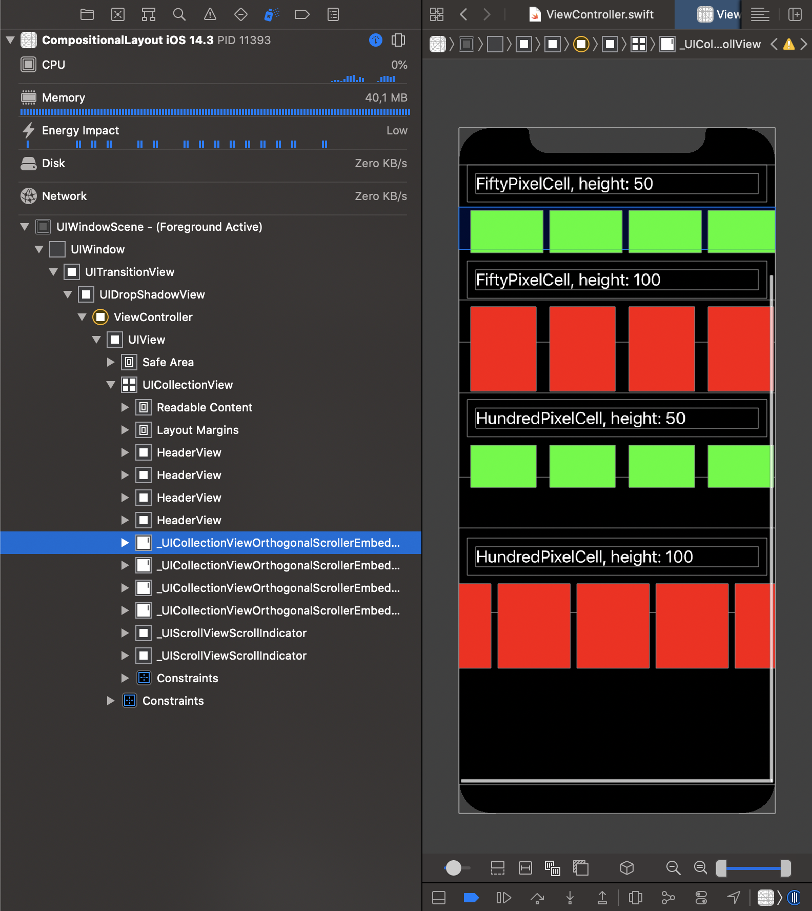
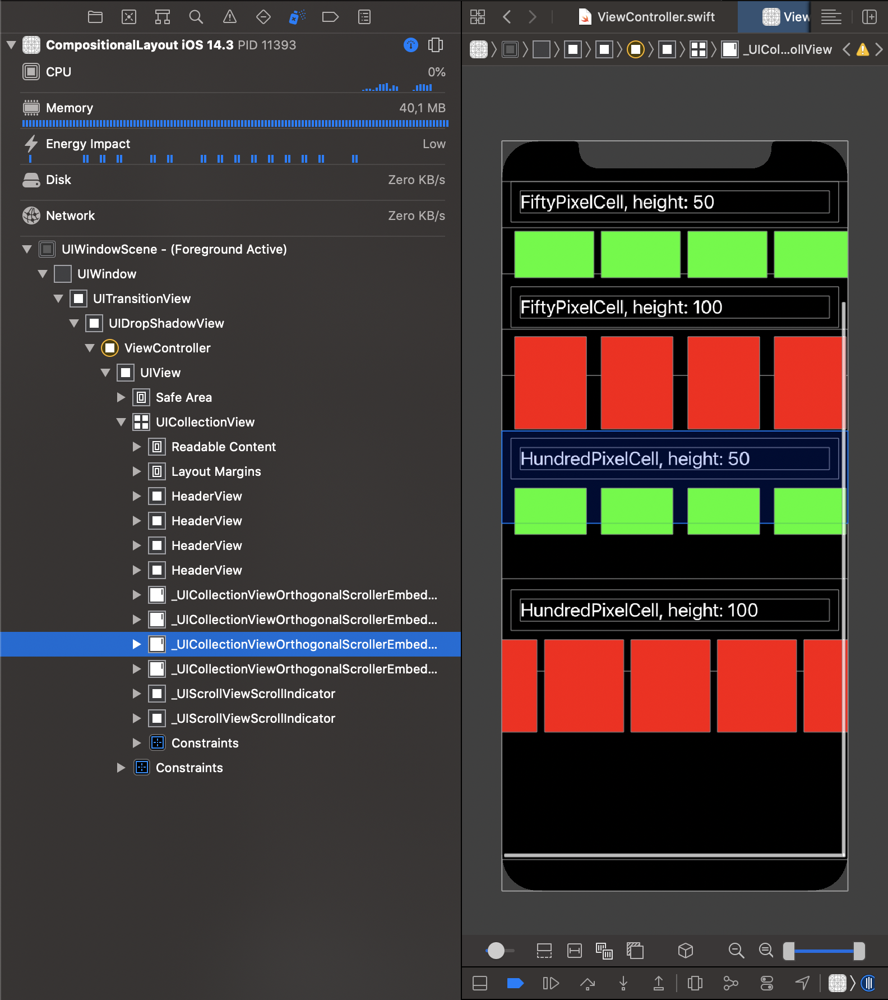
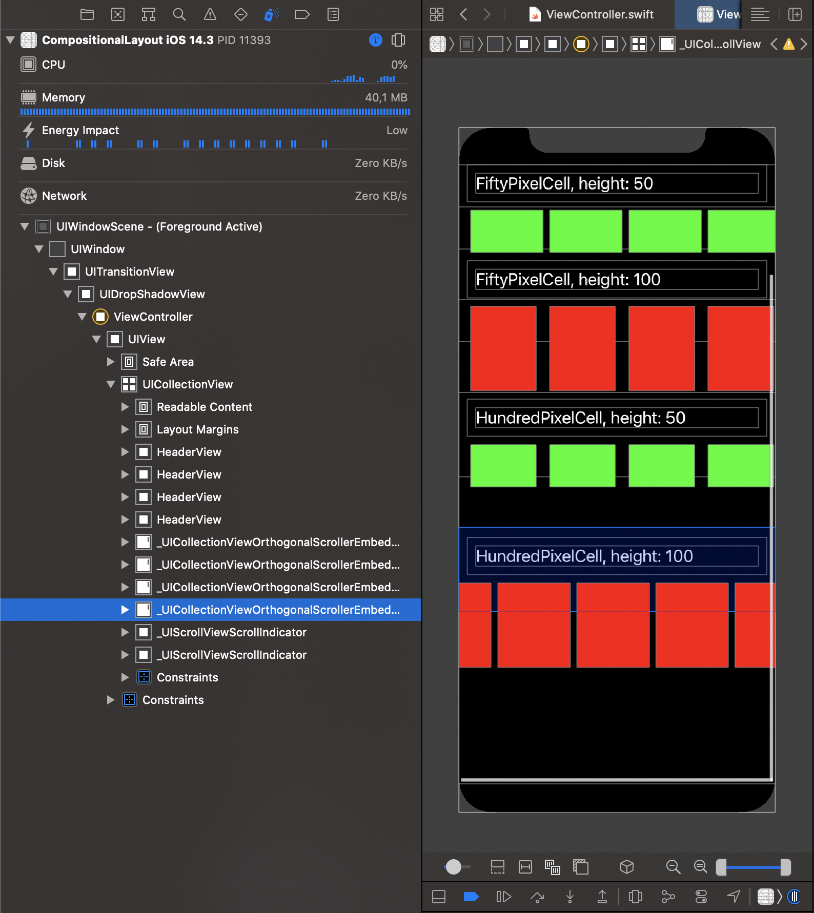

# Compositional Layout issue in iOS 14.3

`iOS 14.3` introduces and issue where `Compositional Layout` might result in mispositioned `_UICollectionViewOrthogonalScrollerEmbeddedScrollView`s if the cell's `estimatedHeight` does not match its constraints. This worked fine prior to `iOS 14.3`.

## Details

See the different screenshots below where it shows that every generated `_UICollectionViewOrthogonalScrollerEmbeddedScrollView` is incorrectly positioned causing touch interactions to be unreliable. Dragging your finger on the bottom part of the cells in the second section will do nothing, but dragging your finger over its title will actually scroll the cells.

An additional use case [can be found here](https://stackoverflow.com/questions/65369130/uicollectionviewcompositionallayout-bug-on-ios-14-3/65421308#65421308).

## First section

This section renders a `UICollectionViewCell` that:

- has a `50.0` height constraint
- has `estimatedHeight(50.0)`

## Second section

This section renders a `UICollectionViewCell` that:

- has a `50.0` height constraint
- has `estimatedHeight(100.0)`

## Third section

This section renders a `UICollectionViewCell` that:

- has a `100.0` height constraint
- has `estimatedHeight(50.0)`

## Fourth section

This section renders a `UICollectionViewCell` that:

- has a `100.0` height constraint
- has `estimatedHeight(100.0)`

